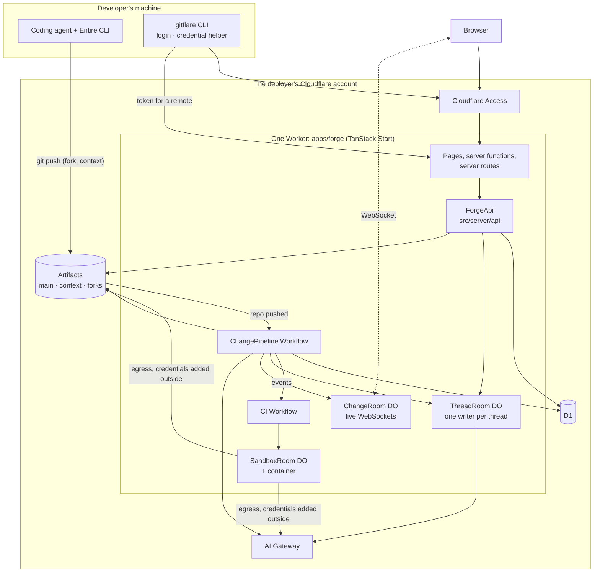

# Architecture

Gitflare is a git forge an organisation deploys to its own Cloudflare account. A developer, or a hosted agent, pushes a session's work to a fork; gitflare works out what the change is for, divides it into sections a person can approve one at a time, reviews it, runs CI, and merges it. What the reviews decide is kept as a decision record that later reviews are given.

This document is the system design for the MVP. Contracts are in code and are pointed at, not restated: when this document and the code disagree, the code is right and this document has a bug. Facts about the platform are in `spec/research/`; commands and conventions are in `AGENTS.md`.

## The system



One Worker holds everything: the web app, the API, three Durable Object classes and two Workflows. D1 holds every record. Artifacts holds git. There is no queue: a push starts a Workflow directly.

## Packages

Every package ships source (`exports` point at `src`), so there is no build step between packages.

| Path | What it is | Owner |
| --- | --- | --- |
| `packages/core` | Domain types and schemas, state machines, hashes, ports, the API contract. `@gitflare/core`, `/ports`, `/api`. | scaffold (frozen) |
| `packages/db` | Drizzle schema, migrations, the `Db` type, the change event log, cost queries, a Node test database. | scaffold (frozen) |
| `packages/testing` | A fake for every port, the demo fixture, `ForgeApi` over the fixture, the database seed. | scaffold (frozen) |
| `packages/ui` | shadcn/ui themed to gitflare's tokens, and gitflare's own components. | GF-8 |
| `packages/artifacts` | `GitHost` over the Artifacts binding, `GitWriter`, repositories, forks, tokens. | `artifacts` |
| `packages/models` | `ModelGateway` over the AI binding; fallback, accounting, budgets. | `models` |
| `packages/identity` | Access JWT validation, user provisioning. | `identity` |
| `packages/diff` | Tree and line diff from object reads. | `diff` |
| `packages/capture` | Reading Entire checkpoints: trailers, slicing, condensing. | `capture` |
| `packages/intent` | The intent stage. | `intent` |
| `packages/sections` | The sectioning stage; folding a new revision into existing sections. | `sections` |
| `packages/review` | The review stage, the agent's turn on a thread, settling threads. | `review` |
| `packages/decisions` | The decision record: files, index, retrieval, strength. | `decisions` |
| `packages/ci` | CI config, planning, running steps in a sandbox. | `ci` |
| `packages/sandbox` | The container controller and egress policy. | `sandbox` |
| `packages/sessions` | Hosted sessions over sandboxes. | `cloud-sessions` |
| `packages/pipeline` | Push handling, stage bookkeeping, readiness, merge, ending a session. | `pipeline` |
| `apps/forge` | The Worker: TanStack Start app, composition root, Durable Object and Workflow shells. | split by path, see Build tasks |
| `apps/cli` | The `gitflare` command. | `cli` |
| `apps/installer` | `create-gitflare`. | `installer` |

Three rules keep these independent.

- A domain package never imports `cloudflare:workers`. It receives the database and the ports it uses as arguments.
- The classes the Workers runtime needs (Durable Objects, Workflows) are thin shells in `apps/forge/src/server` that call into the packages.
- **A domain package does not import another domain package.** Where one needs another's work it depends on a port: `capture`, `diffs` and `decisions` in `packages/core/src/ports/internal.ts` are interfaces between gitflare's own packages, each with a fake. The intent stage is written against `CapturePort` and `DiffPort`, not against `@gitflare/capture` and `@gitflare/diff`; only the composition root knows which package implements which port.

Ports are of three kinds, all in `packages/core/src/ports`: services outside the Worker (`git`, `gitWriter`, `models`, `identity`, `sandboxes`, `cloudSessions`), the Worker's own Durable Objects and Workflows (`live`, `pipeline`, `provisioning`, `threads`), and the internal ones above.

### Inside `apps/forge`

```
src/
  server.ts                 Worker entry: Start's handler + every DO and Workflow class
  router.tsx                one QueryClient per request
  routes/                   file routes: pages, and server routes under routes/api
  components/shell/         the frame, RouteLink, PageHead
  components/threads/       the conversation on a change
  data/                     <slice>.functions.ts (server functions), <slice>.queries.ts, keys.ts
  server/
    services.ts             the composition root: Services = Db + every port
    context.ts, auth.ts     who is calling
    api/                    ForgeApi, one file per slice; index.ts composes them
    adapters/runtime.ts     ports backed by this Worker's own DOs and Workflows
    adapters/cloudflare.ts  ports that leave the Worker (production)
    durable/, workflows/    the shells (workflows/provision.ts is complete, not a stub)
    test-entry.ts           what Worker tests load instead of server.ts
wrangler.jsonc              local: D1, DOs, Workflows only
wrangler.deploy.jsonc       deployed: adds Artifacts, AI, containers, the push trigger
```

## The API surface

There is one contract, `ForgeApi` in `packages/core/src/api/forge-api.ts`: every operation the forge offers, grouped into slices, with zod schemas for inputs (`inputs.ts`) and view types for outputs (`views.ts`). It is reached three ways.

- **The web app uses server functions.** `apps/forge/src/data/<slice>.functions.ts` has one `createServerFn` per operation: the `authed` middleware establishes the caller, the operation's input schema validates, and the handler is one call into `forgeApi()`. `<slice>.queries.ts` exports `queryOptions` factories and mutation hooks over them. Screens use only those; see `AGENTS.md`, "The web app".
- **Everything else uses server routes**, under `src/routes/api`, listed in `httpRoutes` (`packages/core/src/api/http.ts`): health, `me`, git credentials, starting a session, reading one, repository detail, and a development-only push. These are what the CLI calls. They are written with `apiRoute` (`src/server/http.ts`) and call the same `forgeApi()`.
- **The live connection** is a WebSocket at `/api/changes/$changeId/live`, a server route that authenticates and hands the upgrade to the change's Durable Object.

Server functions are same-origin RPC with generated ids, not an API; that is why the CLI gets routes of its own. An operation checks permissions itself with `can()`; the layers above only establish who is asking.

## Git topology

Everything is in one Artifacts namespace per deployment. Names are built and parsed by `packages/core/src/domain/repo-names.ts`.

| Repository | Name | Who writes |
| --- | --- | --- |
| Main | `<slug>` | Only gitflare, by merging an approved change. People get read tokens. |
| Context | `<slug>.context` | The capture client pushes checkpoint refs; gitflare commits decision files to `main`. |
| Session fork | `<slug>.fork.<session>` | The session's owner, with a write token for that fork alone. |

- **A session is a fork.** `gitflare start` (or starting a cloud session) records a session and hands the fork to the `provisioning` port, which runs it in the `ProvisionWorkflow`: a fork is a full copy and takes seconds to most of a minute. The session is usable once `forkReadyAt` is set; the CLI polls `httpRoutes.session` for that. A cloud session's first prompt is stored with the session (`session_launches`) by the request that starts it, and the provisioning step that completes the fork hands it to `cloudSessions.launch`; the request itself launches nothing. Importing a repository and preparing the sandbox workspace go the same way, and each can end in a recorded failure (`Repository.importFailedAt`, a `failed` workspace preparation) instead of never finishing. The developer pushes a branch to the fork as usual; the first branch pushed becomes the session's change, and later pushes to it are revisions. A fork is deleted when its change merges or is abandoned, by `endSession` in `@gitflare/pipeline`, the one function that ends a session.
- **A push event does not say who pushed.** The fork's name carries the session id, the session has one owner, and that is the attribution.
- **Tokens are per repository, with no per-branch rule,** and the server refuses nothing a write token asks for, force pushes and deletions included; `read_only` does not stop a push either. The only way to protect the main repo is never to issue a write token for it. Gitflare mints short-lived tokens through the git credential helper (`repositories.gitCredential`) and records each in `git_tokens`: Artifacts keeps no record of who a token was for.
- **Capture uses Entire's CLI unmodified.** Gitflare commits `.entire/settings.json` (with `checkpoint_remote` pointing at `git/<namespace>/<slug>.context`) and the agent hook settings to the main repo, so a fork inherits them and a clone needs no enable step. On `git push`, the CLI pushes checkpoint refs to the context repo, authenticated by the same credential helper, which must run with `credential.useHttpPath=true` so the two repositories on one host get different tokens. Commits carry `Entire-Checkpoint` trailers; the pipeline reads the named refs at their tips.
- **Decisions are files** under `decisions/` on the context repo's `main`, written by gitflare. The index in D1 can be rebuilt from them.

Known limit: a context-repo write token lets its holder push to any ref there, including `main`, and rewrite or delete a checkpoint. Within one organisation this is accepted; gitflare records each checkpoint's tip when it arrives, and ignores context pushes it did not make except to checkpoint refs.

## Life of a change

Types: `packages/core/src/domain/change.ts`, `pipeline.ts`, `events.ts`. Transitions: `packages/core/src/machines/`.

```
push to fork ──▶ open ──▶ processing ──▶ ready ──▶ merged
                  ▲            │            │
                  └── new push ┴────────────┤        closed (abandoned)
                               ▲            │
                               └── re-run ──┘
```

`ready` means every stage has settled and the change is ready for people. Whether it may merge is a separate question (`mergeReadiness`).

1. **Push.** Artifacts emits `cf.artifacts.repo.pushed`; a `triggers.events` entry starts a `ChangePipelineWorkflow` instance with the raw event. `classifyPush` sorts it: a branch in a fork is a change; a checkpoint ref in a context repo records its new tip; everything else is ignored.
2. **Open or revise.** `handlePush` reads the branch's current tip and its commit range from the fork (events can arrive out of order, and their commit list is not the new commits), creates the change or adds a revision (reading each commit's checkpoint ids with `parseCheckpointTrailers`), and queues one stage run per stage for the head revision. The same push delivered twice is the same revision. The change is visible from this moment.
3. **Wait briefly for checkpoints.** The capture client pushes checkpoints before code but fails soft, and a trailer can name a checkpoint that was never written. The pipeline waits up to a minute for the ids named in the trailers, then goes on without them and says which are missing.
4. **Stages, in parallel.** Each is a `StageHandler`: it reads what it needs, writes its own results, and returns `succeeded` or `skipped`; throwing fails it. A handler is idempotent per attempt: a Workflow retry runs the same attempt again and must add nothing and call no model, while a re-run a person asks for is a new attempt. Stages record the attempt that produced a result (`intents.attempt`, `revision_reviews`) to tell the two apart.
   - **intent** derives what the change is for, graded `transcript` or `diff`. It runs once, when the change opens; on a later revision it is skipped.
   - **sections** divides the diff on the first revision. On a later one it folds the new diff into the existing sections and withdraws approval from exactly the sections whose `contentHash` moved (`approvalsWithdrawnByPush`).
   - **review** opens a comment thread per finding, having been given the decisions closest in meaning to the change (and, of those tied to paths, only the ones that apply to the files it touches). It records that it reviewed the revision, with how many findings, so a clean revision is not reviewed twice.
   - **ci** is its own Workflow. The pipeline starts it and waits for `CI_FINISHED_EVENT`. No CI file in the repository means `skipped`.
5. **Settle.** After each stage, `settleChange` places comments in sections and, once every stage has settled, moves the change to `ready`. A failed stage never hides the change; it shows as failed and can be re-run, which queues a new attempt and returns the change to `processing`. The re-run's Workflow instance is told which attempt to run (`PipelineParams.attempt`) and runs that one only.
6. **Review.** People approve sections, one at a time, and settle comments by answering them. A comment's agent (in `ThreadRoom`) replies, resolves, dismisses with a classification, or pushes a fix to the fork, which is a new revision. A dismissal classified as a design decision records one.
7. **Merge.** `mergeChange` checks `mergeReadiness`: every section has a current approval, every comment is resolved or dismissed, CI is green or skipped. It merges the fork's head into the main repo (a fast-forward when it can be, done in the Worker; otherwise a merge commit), ends the session, settles the change's decisions (followed and cited ones are reinforced, contradicted ones weakened) and deletes the fork.

Every step appends a `ChangeEvent` through `appendChangeEvent` (`packages/db/src/events.ts`): one gap-free sequence per change in D1, then a best-effort broadcast through the change's `ChangeRoom`. A step whose own writes must commit with its event puts `changeEventStatements` in its batch instead, and publishes afterwards with `publishChangeEvent`; nothing else writes to `change_events`. A browser that reconnects says the last sequence number it saw and is replayed the rest. Events say what changed; the page refetches.

Everything asynchronous is at-least-once. Every function a Workflow step calls must be safe to run twice.

## Data model

The schema is `packages/db/src/schema.ts`; read it there. In outline:

- `organisations`, `users` — one organisation per deployment, kept as a record.
- `repositories`, `sessions`, `git_tokens` — a session is a fork and belongs to one user. A repository whose import failed says so and why.
- `session_launches`, `cloud_session_events` — a hosted session's first prompt while it waits for its fork, and what its agent did, kept beyond the sandbox it ran in.
- `changes`, `revisions`, `change_commits`, `stage_runs`, `change_events` — a revision is one push; a stage run is one attempt of one stage for one revision.
- `checkpoints`, `captured_sessions` — the context repo's checkpoint tips, and which agent sessions fed a change.
- `intents`, `revision_reviews`, `sections`, `approvals` — an intent and a review each name the stage attempt that produced them; an approval is tied to the section's `contentHash` and is withdrawn, never deleted.
- `threads`, `thread_messages` — comments and chats. A thread records when it was last considered for a decision worth keeping.
- `ci_runs`, `ci_steps`.
- `decisions`, `decision_events`, `change_decisions` — the index of the decision files, with strength, status and an embedding. An event that reworded a decision holds the whole wording before and after.
- `model_calls` — one row per call through the gateway; a change's cost is a sum over these.

Conventions: prefixed ULID ids (`packages/core/src/ids.ts`), integer milliseconds for time, integer micro-dollars for money, JSON columns typed with core types, no foreign keys, nothing deleted. D1 has no interactive transactions: use `db.batch([...])`.

Durable Object storage holds only what one object owns: a thread's turn in flight, a sandbox's process table. Nothing there is the only copy of a record.

## Identity and permissions

- **People log in through Cloudflare Access**, on a hostname-based application. The forge validates the `Cf-Access-Jwt-Assertion` header itself, because `ctx.access` is not available to a Worker with static assets. (A Worker-level application is documented to reject WebSocket upgrades; the live test saw it accept one, but only with a service token.)
- **"Who is this request from" is one function**: `IdentityProvider.identify(headers)`. `authenticate` (`apps/forge/src/server/auth.ts`) maps the identity to a `User`, creating one on first sight. Every server function and API route goes through it.
- **Roles are gitflare's own**: `admin` and `member`. What each may do is `can()` in `packages/core/src/domain/permissions.ts`.
- **The CLI logs in with Access Managed OAuth** (authorisation code with PKCE on a loopback redirect) and sends the token as a bearer; the forge sees the same JWT header.
- **Model calls carry the user as ordinary gateway metadata.** `ModelAttribution` is the whole metadata vocabulary: five keys, which is the gateway's limit.
- **Sandboxes hold no credentials.** Git and model traffic leave a sandbox through `SandboxEgress`, which adds the token or gateway authorisation outside the container according to the sandbox's `EgressGrant`s. A sandbox reaches only what it was granted. Open Internet access, which preparing the workspace needs, is asked for by name (`openInternet`) and excludes every grant; a host grant of `*` is refused.

## Local development and testing

`pnpm dev` runs the real Worker in workerd with `wrangler.jsonc`, which declares only what runs locally.

| Port | In `pnpm dev` | In Node tests |
| --- | --- | --- |
| Database | local D1, migrated and seeded with the demo on first request | `createTestDb()` |
| `live`, `pipeline`, `provisioning`, `threads` | the real Durable Objects and Workflows, locally | recording fakes |
| `git`, `gitWriter` | `FakeGit`, loaded with the demo's repositories | `FakeGit` |
| `models` | `FakeModelGateway`, answering with placeholders | scripted replies |
| `identity` | signed in as the demo's administrator | `FakeIdentity` |
| `sandboxes`, `cloudSessions` | fakes: no Docker | fakes |
| `capture`, `diffs`, `decisions` | the real packages, reading the fake git host and local D1 | `FakeCapture`, `FakeDiffs`, `FakeDecisions` |

- **Fakes are in one place**, `packages/testing`, one per port, with `createFakePorts()` and `createDemoPorts()`.
- **The demo fixture** (`packages/testing/src/demo`) is one deployment: a repository, a merged change, a change under review with an intent, four sections in different approval states, review comments with replies, green CI and five decisions, and a hosted session mid-pipeline. The seed writes it to D1; the fixture API serves it.
- **Screens work before their backend.** In development `forgeApi()` wraps the real slices so that an operation still throwing `NotImplementedError` is answered by the fixture API (`src/server/api/fallback.ts`). In production there is no fallback.
- **Fake state is per isolate.** Anything that must be seen by another isolate or survive a reload goes in the database.
- **Three kinds of test**, chosen by file name: `*.test.ts` in Node, `*.test.tsx` in happy-dom, `*.worker.test.ts` in workerd. Vitest cannot load the app's own entry, run containers, or reach Artifacts, the AI binding or Access; those are behind ports for that reason.

## What changed from the brief

- **The app is TanStack Start**, not Hono with a hand-wired SPA; the API is server functions for the app and server routes for the CLI. `spec/research/tanstack-start.md`.
- **A thread's Durable Object is its single writer, and settled messages are written through to D1.** Reading every comment on a change, and learning decisions from replies, needs them queryable across threads; the object keeps only the turn in flight.
- **Change events are stored in D1 and the change's Durable Object only fans out.** Every deploy restarts every Durable Object; the log has to outlive that.
- **Two Wrangler configs.** The Artifacts and AI bindings have no local simulation and containers need Docker locally, so none of the three can be declared in the config `pnpm dev` uses.
- **No Dockerfile.** Sandboxes boot the managed image and a prepared snapshot, so installing gitflare needs no Docker.
- **The diff is computed in the Worker** from object reads, not with git in a container. So are commits and fast-forward merges; only a true merge of a larger repository goes to a sandbox, behind `GitWriter`.
- **Three ports are internal.** Capture, diff and the decision record are gitflare's own code, but the packages that use them depend on an interface with a fake, so that they can be built and tested in parallel.
- **A section's content hash is defined once**, `sectionContentHash` in `@gitflare/core`, because approvals stand or fall by it.
- **Structured model output is validated by us** against a zod schema; the port does not assume the gateway's `output_config` is honoured.

## Contracts, round two

The first-pass build tasks worked against frozen contracts and listed what they needed changed. Those changes were made together, in `packages/core`, `packages/db` (one migration, `0001_contracts_round_two.sql`) and `packages/testing`. Other packages were edited only as far as compiling and passing their tests required; the behaviour each change makes possible belongs to that package's hardening task. This is the list to build against.

| What changed | Where | Why |
| --- | --- | --- |
| A decision event holds the whole wording before and after (`DecisionEvent.wording`), replacing the statement pair. An edit that changes nothing records no event; reverting when there is nothing to put back is a `conflict`. | `domain/decision.ts`, `decision_events.wording`, `ForgeApi.decisions` | A revert restored the statement and left a changed title or rationale in place, and reported success for an edit that had changed neither. |
| `DecisionsPort.retrieve` takes the change's `paths`; `decisionApplies` decides whether a path-scoped decision bears on them. | `ports/internal.ts`, `domain/decision.ts` | Decisions tied to paths were retrieved like general rules. |
| `DecisionDetail` carries its repository and the person behind each event. | `api/views.ts` | The decision page showed raw user ids and had no way back to its list. |
| `EmbedResult` carries `usage` and `gatewayLogId`. | `ports/models.ts` | Embedding calls were recorded with no tokens and no log entry. |
| `ModelErrorCode` gains `invalid_request`. | `ports/models.ts` | A request the gateway refuses was reported as an outage and retried on every fallback. |
| A re-run names its attempt: `PipelineParams` and `PipelineRunner.rerunStage` take `attempt`. `Intent.attempt` records which attempt wrote a version, unique per revision. | `domain/pipeline.ts`, `ports/runtime.ts`, `intents.attempt` | A retried Workflow step of a re-run added a second version, and a re-run asked for twice could queue an extra attempt. |
| `RevisionReview`: one row per review attempt that finished, with its number of findings. | `domain/change.ts`, `revision_reviews` | A revision with no findings looked unreviewed and was reviewed, and paid for, again on every retry. |
| `Thread.learnedAt`: when the thread was last considered for a decision. `learnFromThread` sets it whatever it finds, and is called off the request path by whoever settled the thread. | `domain/thread.ts`, `threads.learned_at`, `ports/internal.ts` | "Nothing learned" left no trace, so every repeat call paid for the model again; nothing said who calls it when a person settles. |
| `Repository.importFailedAt` and `importError`. Creating a repository over one whose import failed replaces it. | `domain/repository.ts`, `repositories`, `ForgeApi.repositories.create` | A failed import looked like one still running, forever, and kept its slug. |
| `RepositoryDetail.remote`, `contextRemote` and `SessionView.pushRemote` are `null` when there is no remote, not an empty string. | `api/views.ts` | An empty string is a remote a caller can pass to git by mistake. |
| `changeEventStatements`, `storedChangeEvent`, `publishChangeEvent`. | `packages/db/src/events.ts` | Stages that must commit an event with their own writes had copied the event SQL, or lost the event when a run died between the two. |
| The `thread.message` event names the message's own number `messageSeq`. No event body may use `changeId`, `seq` or `at`; a type check enforces it. | `domain/events.ts` | The message's `seq` was overwritten by the event's. |
| `thread.draft_discarded`, a transient signal. | `domain/events.ts` | A browser showing a reply being typed was never told the turn had failed. |
| `ThreadView.settledBy` and `ChangeDetail.mergedBy` are people (`UserRef`). `Thread.settledBy` null on a settled thread means the agent settled it. | `api/views.ts`, `domain/thread.ts` | Someone who settled without posting had no name, and "null means the agent" was a guess. |
| `SandboxStartOptions.openInternet`; a host grant of `*` is `invalid`; `checkStartOptions` is the one check, shared by the fake and the controller. | `ports/sandbox.ts` | Only the sandbox package knew that `*` meant an unfiltered network. |
| A sandbox that is not running throws `unavailable` from everything but `isRunning`, `start` and `stop`. A command that fails, or cannot be launched (`EXIT_NOT_LAUNCHED`), is a result and never a throw. | `ports/sandbox.ts` | A missing binary was reported as a lost sandbox, so CI called a failed step an infrastructure failure. |
| `CloudSessions.launch` is called only by the provisioning step that completes the fork, for a session whose fork exists, and is safe to call twice. The first prompt waits in `session_launches`. | `ports/runtime.ts`, `domain/cloud-session.ts`, `session_launches` | The port said the fork must exist; its only caller called it before the fork did, and the prompt had nowhere to wait. |
| `cloud_session_events`: a hosted session's events, with `seq` counting across a stop and a resume. | `cloud_session_events`, `toCloudSessionEvent` | The event log lived in the sandbox and was gone when it stopped. |
| `CiConfig.egress.hosts`, `CiStatus` gains `skipped`, `CiRun.reason`. | `domain/ci.ts`, `ci_runs.reason` | Only one registry could be reached; a step that never ran read as cancelled; a run that failed before any step lost its reason. |
| `WorkspaceSettings.preparation`: `running`, or `failed` with the error. | `domain/organisation.ts` | Settings could not say that preparation was under way or had failed, so the page polled without end. |
| `sectionContentHash` no longer depends on the order a section lists its files in. `sectionStats` and `sections.stats` hold a section's size. | `domain/section-hash.ts`, `sections.stats` | Reordering a section's files withdrew its approvals; every change page recomputed the diff to count lines. |

The fakes were tightened to match:

- `FakeSandbox` throws `unavailable` once stopped or lost (`FakeSandboxHost.lose`), throws `conflict` on a second start, refuses what `checkStartOptions` refuses, and can hold a spawned process `running` until `finish`.
- `FakeCloudSessions` launches a session once, refuses a prompt before the launch, and refuses a launch for a fork that is not ready when given `forkReady`.
- `FakeModelGateway.fail` applies to embeddings. `FakeGit.failNextCommit` fails one commit on demand, and `FakeGit.onPush` raises the push a commit of gitflare's own would raise.
- `FakeDecisions.retrieve` honours `paths`. The fixture API returns copies, as a server function does.

## Live tests

Four spikes ran on a real account on 2026-10-02. Three of their notes are in `spec/research/live/`: `artifacts-git.md`, `entire-on-artifacts.md` and `gateway-access.md`. The fourth, `container-git.md`, is in pull request #14 and lands there when that merges; items 10 and 11 below come from it. This table is every assumption the design rests on that the research could not verify: what was then observed, and what the design does about it. Items still marked open keep their fallback.

| # | The design assumes | Observed | Consequence |
| --- | --- | --- | --- |
| 1 | A `triggers.events` entry filtered by namespace alone fires for every repository in it, forks created later included, and the Workflow receives the push event as its payload. | **Holds.** The payload is the documented event plus an `id`, which is also the instance id. Events are one per ref, can arrive out of order, and name no actor. `commits` is a first-parent walk capped at 20, not the new commits. Loss and duplication: none in 76 events, which proves little. | The pipeline takes the repository and ref from the event and reads the ref's tip itself. `handlePush` is idempotent and order-independent. No Queue. |
| 2 | Artifacts accepts pushes to, and serves, `refs/entire/checkpoints/*`, and emits a push event for them. | **Holds.** | Entire's default `git-refs` backend. The legacy branch backend is not handled: a push to it is ignored. |
| 3 | The binding resolves a full ref name outside `refs/heads`. | **Does not hold.** `log()` takes a short branch or tag name or a commit id, nothing else. | As designed for this case: checkpoint tips come from push events (`checkpoints`), and are read by commit id. `GitHost.resolveRef` is documented accordingly. |
| 4 | The unmodified Entire CLI pushes checkpoints to a sibling Artifacts repository from a committed `checkpoint_remote`. | **Holds**, with provider `artifacts` and a git credential helper using `credential.useHttpPath=true`. `ENTIRE_CHECKPOINT_TOKEN` must not be set. A clone carrying the committed files needs no `entire enable`. A trailer does not guarantee its checkpoint exists: the push is fail-soft and condensation can fail for good. | No fork of the CLI. The change page shows capture as present, pending or missing (`ChangeCapture.missingCheckpointIds`); the pipeline's wait is bounded and a change never waits on evidence. |
| 5 | The `Cf-Access-Jwt-Assertion` header reaches a Worker with static assets. | **Holds**; it verifies with `jose`, and `ctx.access` is undefined, as expected. Browser login was not driven: a user token's claims are unobserved. | `createAccessIdentity` validates the header. Still open: `email` and a stable `sub` on a real user token. |
| 6 | A WebSocket upgrade reaches a Durable Object behind Access, through a TanStack Start server route. | **Partly.** The upgrade got through Access, with a service token, under both hostname-based and Worker-level applications; the documented `403` did not occur. Not tried: a browser's cookie session, and the path through a deployed Start route (it works under `vite dev`). | Stay on a hostname-based application until a browser session is tested. Fallback unchanged: handle the live path in `src/server.ts` before Start's handler. |
| 7 | A Worker can commit to, and merge on, an existing repository without a container. | **Holds for commits and fast-forward merges**: tens of milliseconds of CPU at any size, with no clone. A true merge with isomorphic-git worked on a 37 MiB repository at 7–14 s CPU and about 100 MB, the edge of an isolate. | `GitWriter` has two implementations in `@gitflare/artifacts`: in the Worker for commits, fast-forwards and small true merges; in a sandbox for true merges of larger repositories. Decision files never need a container. |
| 8 | `env.AI.run("anthropic/…")` takes the Anthropic body and its cost can be read back. | **Unproven for Claude**: the account had neither credits nor a stored key, and every call returned `402`. Established with other models and by validation errors: schemas are enforced per model, `system` must be a string, Opus rejects a forced tool choice, the gateway caches identical requests even at `cache_ttl: 0`, and cost is on the log within half a second. `output_config.format` passes validation and is unproven end to end. | `ModelError` has a `no_credits` code; the installer checks for credits or a stored key; the adapter always passes `skipCache`; structured output is requested in the prompt and validated by us. Still open: one served Claude call, and `output_config.format`. |
| 9 | A budget breach can be told from a rate limit. | **Holds**: `429` with code `2045` against `2003`, readable only from the start of the error message. Spend-rule windows are seconds; fixed windows align to the clock. A cache hit bypasses spend rules. | `withFallback` falls back on `budget_exceeded`, not on `no_credits`. |
| 10 | Git from a sandbox to Artifacts works with the token added at the egress. | **Holds** for clone, fetch of a fork, merge and push, with Internet access off. The gateway also enforced the repository scope. A full clone of a 33 MB repository took about 60 s; `--depth=1` about 2 s. | No credential enters a container. Sandboxes clone shallow. Trust the container CA alone only with a `*` intercept; otherwise tools hang silently. |
| 11 | A sandbox starts fast enough, and deploying one needs little. | **Holds.** The managed image deploys with no Docker; it has no git, but a snapshot taken after installing it starts offline in about 0.5 s. A container stops 10–15 s after its Durable Object goes idle unless an inactivity timeout is set. Output reaches the Durable Object about 45 ms after it is printed. | The workspace is the managed image plus a prepared snapshot (`containers/workspace/setup.sh`), not a Dockerfile. Which snapshot is recorded in the organisation's `workspace` settings by `account.prepareWorkspace`; every sandbox boots from `workspaceStart(settings.workspace)`. The keep-alive alarm is required. Resuming a hosted agent's own session from a snapshot is still open. |
| 12 | Access Managed OAuth works for a CLI. | **Open.** Only the discovery documents were fetched. | Fallback unchanged: `cloudflared access login`. |
| 13 | Forks are cheap enough at one per session. | **A fork is a full copy of every ref**, whatever `defaultBranchOnly` says, stored in full. `fork()` took 41 s on a 33 MB repository; `import()` of the same repository failed twice. `read_only` does not stop a push, and the server refuses nothing a write token asks for. | Forking and importing run in the `ProvisionWorkflow`, started through the `provisioning` port (`Session.forkReadyAt`, `Repository.readyAt`, `Repository.importFailedAt`). Forks are deleted as soon as their change merges or is abandoned. Withholding write tokens is the main repository's only protection, as designed. |
| 14 | Durable Objects declared with `exports` deploy alongside containers and Workflows. | **Open.** The spikes used their own configs; this exact combination was not deployed. | Fallback unchanged: a `migrations` array, chosen before the first production deploy. |
| 15 | People who are not Cloudflare account members can log in under an email policy on a fresh Zero Trust organisation. | **Open.** The test organisation already had the one-time PIN provider. | The installer adds that provider. |

Two findings were not on the list. A write token for the context repo can rewrite or delete any checkpoint, so a checkpoint is indexed with its tip when its push arrives and a later rewrite is detectable. And a plain `git clone` of a context repo is empty: the evidence is under `refs/entire/`, fetched with an explicit refspec.

## MVP decisions the owner may revisit

- **A change being ready shows in the reviewer's inbox and nothing more.** No email, no chat notification. Home: `changes.list` with `scope: "inbox"` (`pipeline`) and the inbox screen (`web-inbox-repos`).
- **Spend is limited per deployment only.** One monthly budget at the gateway and a per-change cap enforced by gitflare; per-user and per-agent limits come later. Home: the installer creates the gateway's one spend rule; `withChangeBudget` in `models`.
- **A fork is deleted when its change merges or is abandoned by an explicit action.** There is no scheduled sweep of idle forks. Home: `endSession` (`pipeline`), called by `mergeChange`, `closeChange` and the `sessions.abandon` operation.
- **An author may approve their own sections, and the approval is recorded as a self-approval** (`Approval.selfApproval`) and shown as one. Home: `changes.approveSection` (`pipeline`) and the change page (`web-change`).

## Build tasks

Each task owns the paths listed and nothing else. All of them can start now, against the stubs: a package another task owns exposes its functions already, typed, throwing `NotImplementedError`. Where a task's tests need another package's behaviour, they inject a fake of it. Only `integration` waits for the others.

Checks for every task, in addition to its own: `pnpm check` passes at the root.

### Backend

**`diff`** — Diff from object reads · `simple`
Owns `packages/diff/**`.
Builds `diffCommits` (walk two trees, descending only where ids differ; line-diff changed blobs; detect renames; mark binary and oversized files), `mergeBase`, `diffStats`, `formatUnified`, and `createDiffs`, the `DiffPort` over them. Every hunk carries `hunkHash` from `@gitflare/core`.
Done when: against the demo's fake git host, `sectionContentHash` of its diff equals every demo section's `contentHash` (the same assertion `FakeDiffs` passes in `packages/testing`); a tree whose id did not change is never read; a binary file yields no hunks.

**`capture`** — Reading Entire checkpoints · `simple`
Owns `packages/capture/**`.
Builds checkpoint tip recording, reading a checkpoint tree (both id formats, chunked transcripts), slicing by `checkpoint_transcript_start`, `captureChange`, `condense` (port of `prototypes/derivation/src/transcript.ts`), the settings files gitflare commits, and `createCapture`, the `CapturePort` over them. Trailer parsing is already in core (`parseCheckpointTrailers`).
Done when: `captureChange` for the demo's change under review, read from the demo's fake git host, returns one session with the demo's agent session id, checkpoint id and prompts; a second checkpoint of the same session contributes only its own slice; a change with no trailers yields an empty capture; the settings file matches Entire's documented schema.

**`intent`** — The intent stage · `simple`
Owns `packages/intent/**`.
Builds `runIntentStage` (port of `prototypes/derivation/src/derive.ts`, without claims or refusal) and `currentIntent`. Reads the capture and the diff through `CapturePort` and `DiffPort`.
Done when: with a scripted model, a change with a capture gets a `transcript` intent and one without gets `diff`; a second revision is skipped with a reason; a re-run adds a version; a malformed model reply fails the stage.

**`sections`** — The sectioning stage · `complex`
Owns `packages/sections/**`.
Builds `runSectionsStage` and `foldRevision`.
Done when: `foldRevision` on the demo's first and second revisions leaves two sections' hashes unchanged and moves two; the stage withdraws exactly those sections' approvals and emits the events; every changed file lands in exactly one section; running the stage twice for one revision changes nothing.

**`review`** — Automatic review and the conversation · `complex`
Owns `packages/review/**`, `apps/forge/src/server/durable/thread-room.ts`, `apps/forge/src/server/api/threads.ts`.
Builds `runReviewStage`, `dismissalTally` (how often each category of finding was dismissed as not a problem, read by the stage before it raises that category again), `appendMessage`, `runAgentTurn` (reply, resolve, dismiss with classification, push a fix through `GitWriter`; its reply streams as `thread.delta` signals), `settleThread`, the `ThreadRoom` shell, and the `threads` slice.
Done when: the stage is idempotent per revision and is given the decisions `DecisionsPort.retrieve` returns; messages of one thread get consecutive `seq` under concurrent posts (a worker test); a dismissal as a design decision calls `DecisionsPort.record`; a category dismissed as not a problem shows in `dismissalTally` and reaches the review prompt; a requested fix commits to the fork; the `threads` slice returns the demo's threads from the seeded database.

**`decisions`** — The decision record · `complex`
Owns `packages/decisions/**`, `apps/forge/src/server/api/decisions.ts`.
Builds the file format, `recordDecision`, `recordDecisionEvent`, `retrieveDecisions` (embed, cosine in memory, active only), `settleChangeDecisions`, `learnFromThread`, `reindexDecisions`, `createDecisionRecord` (the `DecisionsPort` over them), and the `decisions` slice.
Done when: a file round-trips; strength moves only through `applyDecisionEvent`; a dormant decision is never retrieved and can be revived; reverting restores the earlier wording and records it; `reindexDecisions` rebuilds the demo's index from the context repo.

**`ci`** — CI · `complex`
Owns `packages/ci/**`, `apps/forge/src/server/workflows/ci.ts`.
Builds config parsing, `planSteps`, `startCiRun` (the sandbox boots from `workspaceStart(settings.workspace)`), `startCiStep`, `pollCiStep`, `finishCiRun`, `readStepLog`, and the `CiWorkflow` shell.
Done when: against `FakeSandboxHost`, a passing run records green steps and a failing step fails the run and skips its dependants; no CI file skips the stage; an unprepared workspace fails it with the reason from `workspaceStart`; each function is safe to call twice; a worker test runs the Workflow to completion and sees `CI_FINISHED_EVENT` sent.

**`sandbox`** — Containers · `complex`
Owns `packages/sandbox/**`, `apps/forge/src/server/durable/sandbox-room.ts`, `apps/forge/src/server/egress.ts`, `apps/forge/containers/**`.
Builds `SandboxController` over `ContainerLike` (start from the managed image or a snapshot, exec with timeout, background processes, keep-alive alarm with an inactivity timeout, snapshot), `createSandboxHost`, `decideEgress`, the `SandboxRoom` and `SandboxEgress` shells, `containers/workspace/setup.sh`, and `prepareWorkspace`, which runs that script in a fresh container and returns the snapshot (the `ProvisionWorkflow` stores it).
Done when: the controller passes its tests against a fake `ContainerLike`; `decideEgress` allows only granted hosts and methods and scopes git to the granted repository; `setup.sh` passes `shellcheck`. The working recipe is `spec/research/live/container-git.md` (pull request #14, until it merges); running it for real is checked by `integration`.

**`cloud-sessions`** — Hosted sessions · `complex`
Owns `packages/sessions/**`.
Builds `createCloudSessions` over `SandboxHost` (boot from `workspaceStart(settings.workspace)`, check out the fork, run the agent per prompt, parse its events, stop and resume), `parseAgentEvents`, `agentCommand`.
Done when: against `FakeSandboxHost`, `launch` starts a sandbox with only git and model egress grants, runs the agent command and yields its events in order; malformed event lines are skipped; `stop` then `prompt` resumes.

**`pipeline`** — From push to merge · `complex`
Owns `packages/pipeline/**`, `apps/forge/src/server/workflows/change-pipeline.ts`, `apps/forge/src/server/api/changes.ts`, `apps/forge/src/server/api/dev.ts`.
Builds `handlePush`, `runStage`, `recordStageOutcome`, `settleChange`, `queueStageRerun`, `mergeChange`, `closeChange`, `endSession` (the only code that ends a session and deletes its fork), the Workflow shell, and the `changes` and `dev` slices. The wait for checkpoints uses `CapturePort.missingCheckpoints`; `ChangeDetail.capture` is built with `captureState`.
Done when: with the fakes and injected stage handlers, a push opens a change, a second push adds a revision, the same push twice adds nothing; a failing stage leaves the change `ready`; merge is refused with the blockers and succeeds once they clear; a conflict leaves the change unchanged; an author's own approval is stored as a self-approval; merging or closing deletes the fork; pushes delivered out of order end at the same revision; a worker test drives the Workflow with fake stages; the `changes` slice returns the demo's views.

**`live`** — Live status · `simple`
Owns `apps/forge/src/server/durable/change-room.ts`, `apps/forge/src/data/live.ts`.
Builds the `ChangeRoom` (hibernatable WebSockets, replay from `changeEventsAfter`, fan-out) and, in `live.ts`, one shared connection per change behind three hooks: `useChangeLive` (connect, resume, reconnect, invalidate `keys.changes.one`), `useChangeSignal` and `useThreadDraft` (the text of a reply being typed).
Done when: a worker test connects two clients, publishes, and both receive it; a client resuming from a sequence number is replayed the gap; the hook invalidates on an event, and two components listening to one change share one socket (happy-dom tests with a fake socket).

**`artifacts`** — Git on Artifacts · `complex`
Owns `packages/artifacts/**`, `apps/forge/src/server/api/repositories.ts`, `apps/forge/src/server/api/sessions.ts`.
Builds `createArtifactsGitHost`, `createWorkerGitWriter` (commit by hand-built pack, fast-forward by relaying the fork's pack, small true merges with isomorphic-git), `createSandboxGitWriter` (larger true merges, over the `sandboxes` port), `provisionRepository` (import in the background; the capture settings files come from `CapturePort.settingsFiles`), `openSession` (records the session and calls `provisioning.forkSession`), `completeSessionFork` and `completeRepositoryImport` (the steps the `ProvisionWorkflow` runs), `issueGitCredential`, `mintSystemToken`, and the `repositories` and `sessions` slices (cloud operations pass through to the `cloudSessions` port).
Done when: the adapter passes its tests against a stub of the binding, including `FORK_IN_PROGRESS`; credentials are refused for another user's fork and recorded when issued; with `RecordingProvisioner`, a started session has `forkReadyAt` null and its fork is requested; with `FakeGit.holdCopies`, `completeSessionFork` throws until the copy is finished and then marks it ready; `sessions.abandon` ends the session through `endSession` from `@gitflare/pipeline` (or `closeChange` when it has a change); the slices pass against `FakeGit`. Write the pack and relay code from `spec/research/live/artifacts-git.md`, section 5.

**`models`** — Models · `complex`
Owns `packages/models/**`.
Builds `createGatewayModels`, `withFallback`, `withAccounting`, `withChangeBudget`, `composeModels`, `cosineSimilarity`. (Reading cost back is already in `@gitflare/db`: `changeCost`, `budgetSummary`.)
Done when: against a stub of the AI binding, a request becomes the documented Anthropic body with a string `system`, `skipCache` set and validated attribution as metadata; `402`/`2021` is `no_credits`, `429`/`2045` is `budget_exceeded` and `429`/`2003` is `rate_limited`; a non-validating reply is `invalid_output`; fallback happens on `budget_exceeded`, never on `no_credits`, and is recorded; a change over its budget is refused before the gateway is called.

**`identity`** — Identity · `simple`
Owns `packages/identity/**`, `apps/forge/src/server/api/account.ts`.
Builds `createAccessIdentity` (jose, remote key set, header then cookie), `provisionUser`, and the `account` slice (the budget comes from `budgetSummary` in `@gitflare/db`; `prepareWorkspace` checks the caller is an administrator and calls `provisioning.prepareWorkspace`).
Done when: tokens signed with a test key validate; wrong audience, wrong issuer, expired and service tokens return null; the first-administrator address becomes an admin; a member cannot change roles.

### Screens

Screens read and write only through `apps/forge/src/data`. Each builder looks at their screen in a browser (`pnpm dev`, then the `agent-browser` skill) and attaches a screenshot.

**`web-change`** — The change page · `complex`
Owns `apps/forge/src/routes/changes/**` (components in `routes/changes/-components/`).
Builds the page a reviewer works on: intent and its grade, whether the session's capture is present, pending or missing (`ChangeDetail.capture`), stage status with re-run, sections in reading order with explanation first and the diff one click away, per-section approval and its history (a self-approval is shown as one), merge readiness and merge, cost. Places `SectionThreads` and `ChangeThreads`.
Done when: against the demo it shows an approved, a pending and a withdrawn section correctly, approving clears a blocker, and merge is offered only when ready.

**`web-threads`** — Comments and chat · `complex`
Owns `apps/forge/src/components/threads/**`.
Builds `SectionThreads` and `ChangeThreads` behind their current props: findings with replies, the agent's actions, replying, resolving, dismissing with a classification, reclassifying, starting a chat, and a reply appearing as it is typed (`useThreadDraft` from `@/data/live`; do not open a connection).
Done when: against the demo it renders the four threads in their states, and each mutation updates the page.

**`web-inbox-repos`** — Inbox and repositories · `simple`
Owns `apps/forge/src/routes/index.tsx`, `apps/forge/src/routes/-inbox/**`, `apps/forge/src/routes/repos/index.tsx`, `apps/forge/src/routes/repos/new.tsx`, `apps/forge/src/routes/repos/$repoSlug/index.tsx`, `apps/forge/src/routes/repos/-components/**`.
Builds the inbox (what waits on you first), the repository list, creating or importing one (an import shows as not ready until `readyAt` is set), and a repository's page with how to clone it and turn capture on.

**`web-decisions`** — The decision record · `simple`
Owns `apps/forge/src/routes/repos/$repoSlug/decisions.tsx`, `apps/forge/src/routes/decisions/**` (components in `routes/decisions/-components/`).
Builds the list (active and dormant), a decision's page with its history and where it came from, and editing, reverting, reviving and adding one.

**`web-sessions`** — Sessions and settings · `simple`
Owns `apps/forge/src/routes/sessions/**`, `apps/forge/src/routes/settings/**` (components in a `-components/` folder inside each).
Builds starting a session (it shows as preparing until `forkReadyAt` is set), a hosted session's page (prompt, the agent's events, stop, abandon), members and roles, spend against the budget, and preparing the workspace with its current state.

### Outside the Worker

**`cli`** — The `gitflare` command · `complex`
Owns `apps/cli/**`.
Builds `login` (Access Managed OAuth, refresh token in the OS keychain), `credential` (git's helper protocol over `httpRoutes.gitCredentials`), `clone`, `start` (starts a session, then polls `httpRoutes.session` until its fork is ready), `capture enable`, `status`, and a build that produces one runnable file.
Done when: every command passes against a fake `CliContext`; the credential helper answers git's `get` for main, fork and context remotes and stays silent for other hosts.

**`installer`** — `create-gitflare` · `complex`
Owns `apps/installer/**`.
Builds the questions, `planInstall`, each step as look-up-then-create, the answer store, rendering the deploy config, and `--dry-run`. Steps include checking that the gateway has prepaid credits or a stored provider key (without one every model call fails), creating the gateway's one deployment-wide spend rule, and, last, telling the administrator to prepare the workspace in Settings (the installer cannot: it has no session with the forge).
Done when: `--dry-run` prints the full plan with no network; against a fake API a second run changes nothing; a missing precondition, credits included, stops with a link.

**`integration`** — Real adapters, wired · `complex` · after every other task
Owns `apps/forge/src/server/adapters/cloudflare.ts`, `apps/forge/wrangler.deploy.jsonc`, `apps/forge/src/server.ts`, and an end-to-end test directory it creates.
Builds `createCloudflarePorts`, the release build against the deploy config, an end-to-end test on fakes from a simulated push to a merge, and settles the items still open under "Live tests" on a real account, applying the fallback wherever an assumption fails.
